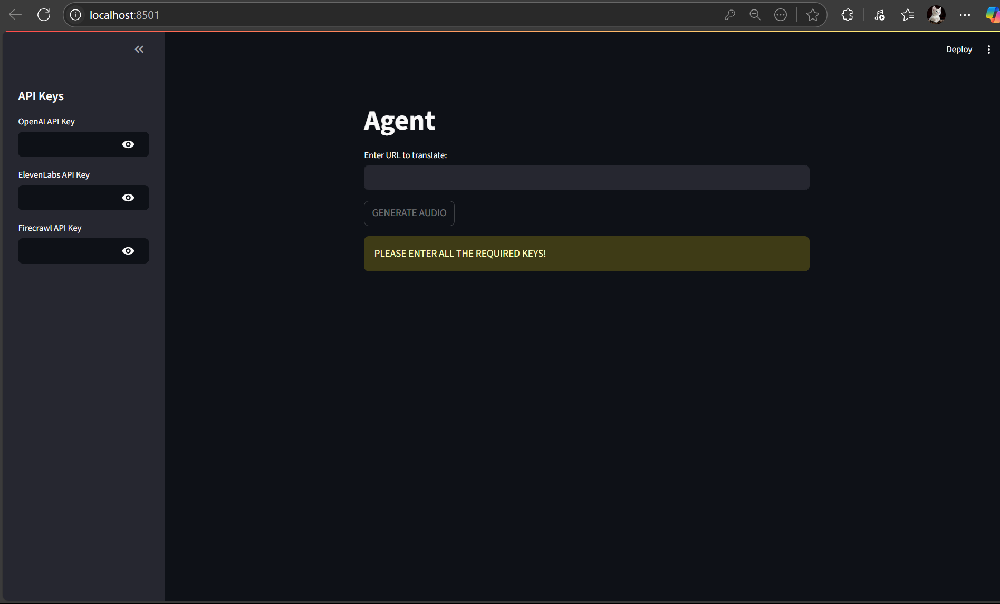

# Blog to Podcast Agent

## Overview
The Blog to Podcast Agent is a Streamlit-based application that converts blog post content into an engaging audio podcast. Using the `agno` framework, it scrapes blog content from a provided URL, generates a concise summary, and converts it to audio using ElevenLabs' text-to-speech API. The application features a user-friendly interface for inputting API keys and URLs, with the generated podcast available for playback and download.

## Features
- **Web Scraping**: Uses FirecrawlTools to extract blog content from a given URL.
- **Summarization**: Creates a conversational summary (1000–2000 characters) of the blog content using OpenAI's GPT-4o model.
- **Text-to-Speech**: Converts the summary into audio using ElevenLabs' multilingual voice model.
- **Streamlit UI**: Provides an intuitive interface for entering API keys, URLs, and generating/downloading podcasts.
- **Error Handling**: Includes validation for API keys and URLs, with clear error messages for users.

## Prerequisites
- Python 3.8 or higher
- API keys for:
  - [OpenAI](https://platform.openai.com/) (for GPT-4o)
  - [ElevenLabs](https://elevenlabs.io/) (for text-to-speech)
  - [Firecrawl](https://firecrawl.dev/) (for web scraping)
- Git (for cloning the repository)

## Installation
1. **Clone the Repository**:
   ```bash
   git clone https://github.com/your-username/blog-to-podcast-agent.git
   cd blog-to-podcast-agent
   ```
2. **Create a Virtual Environment**:
   ```bash
   python -m venv venv
   source venv/bin/activate  # On Windows: venv\Scripts\activate
   ```
3. **Install Dependencies**:
   ```bash
   pip install -r requirements.txt
   ```
   Ensure `requirements.txt` includes:
   ```
   streamlit
   agno
   ```
   *Note*: The `agno` package is assumed to be a custom or third-party library. Replace it with the correct package name or installation instructions if needed.
4. **Set Up API Keys**:
   - Obtain API keys from OpenAI, ElevenLabs, and Firecrawl.
   - These will be entered via the Streamlit UI when running the app.

## Usage
1. **Run the Application**:
   ```bash
   streamlit run main.py
   ```
2. **Access the UI**:
   - Open your browser and navigate to `http://localhost:8501`.
3. **Enter API Keys**:
   - In the sidebar, input your OpenAI, ElevenLabs, and Firecrawl API keys.
4. **Provide a Blog URL**:
   - Enter the URL of the blog post you want to convert into a podcast.
5. **Generate the Podcast**:
   - Click the "GENERATE AUDIO" button.
   - The app will scrape the blog, summarize the content, and generate an audio file.
   - Listen to the podcast in the UI or download it as a WAV file.

## Screenshots
Below are screenshots of the Blog to Podcast Agent in action, showcasing the Streamlit interface:

1. **Initial State with Missing API Keys**:
   - Displays the app's initial state with a warning when API keys are not entered.
   - 

2. **URL Input with API Keys Provided**:
   - Shows the interface after entering API keys and a blog URL, with the "GENERATE AUDIO" button enabled.
   - 

*Note*: To add screenshots, run the app (`streamlit run main.py`), capture the interface at `http://localhost:8501` using a tool like Snipping Tool (Windows), Command+Shift+4 (Mac), or browser developer tools, and save them as `initial_state.png` and `url_input_state.png` in a `screenshots` directory. Update the image paths in this README with the actual file locations or URLs (e.g., if hosted on GitHub).

## Project Structure
```
blog-to-podcast-agent/
├── main.py                 # Main application script
├── audio_generations/      # Directory for storing generated audio files
├── requirements.txt        # Python dependencies
└── README.md               # Project documentation
```

## Error Handling
- **Missing API Keys**: The app displays a warning if any API key is not provided.
- **Invalid URL**: A warning is shown if the URL field is empty.
- **API or Processing Errors**: Errors during scraping, summarization, or audio generation are caught and displayed with details.

## Dependencies
- `streamlit`: For the web interface.
- `agno`: For the agent framework, including OpenAI, ElevenLabs, and Firecrawl tools.
- `python 3.8+`: For compatibility with all libraries.

## Notes
- Ensure your API keys are valid and have sufficient quotas.
- The summary is constrained to 1000–2000 characters to comply with ElevenLabs API limits.
- Generated audio files are saved in the `audio_generations` directory with unique filenames using UUIDs.

## Contributing
Contributions are welcome! Please:
1. Fork the repository.
2. Create a feature branch (`git checkout -b feature-name`).
3. Commit your changes (`git commit -m 'Add feature'`).
4. Push to the branch (`git push origin feature-name`).
5. Open a pull request.

## License
This project is licensed under the MIT License. See the [LICENSE](LICENSE) file for details.

## Acknowledgments
- Built with [Streamlit](https://streamlit.io/), [OpenAI](https://openai.com/), [ElevenLabs](https://elevenlabs.io/), and [Firecrawl](https://firecrawl.dev/).
- Thanks to the `agno` framework for simplifying agent-based workflows.